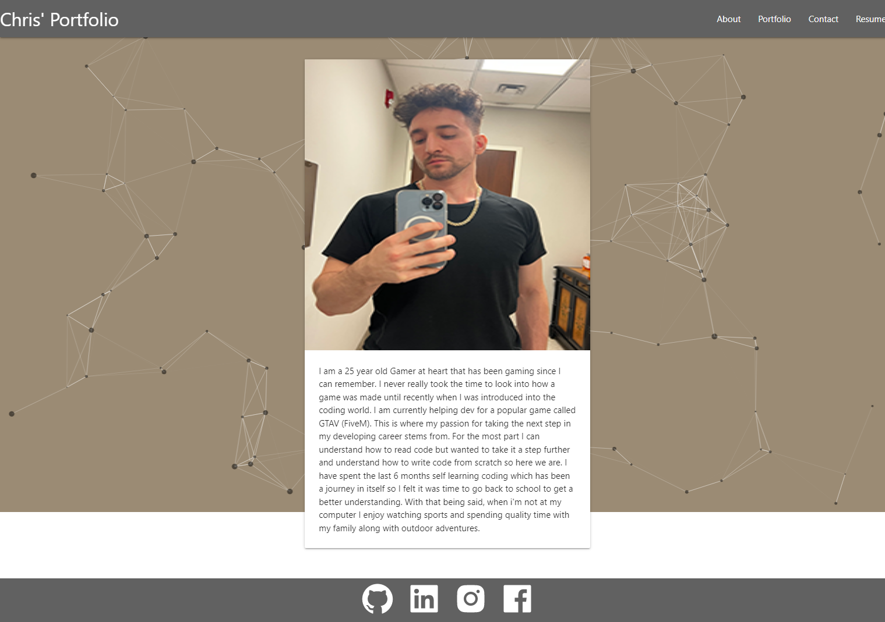
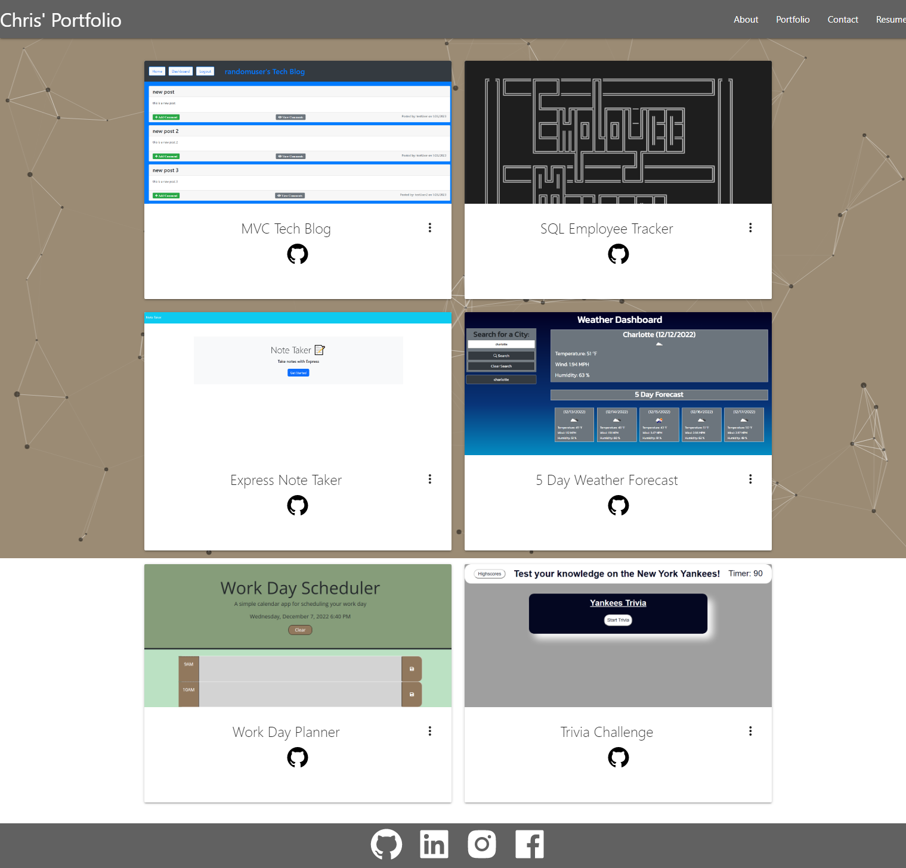
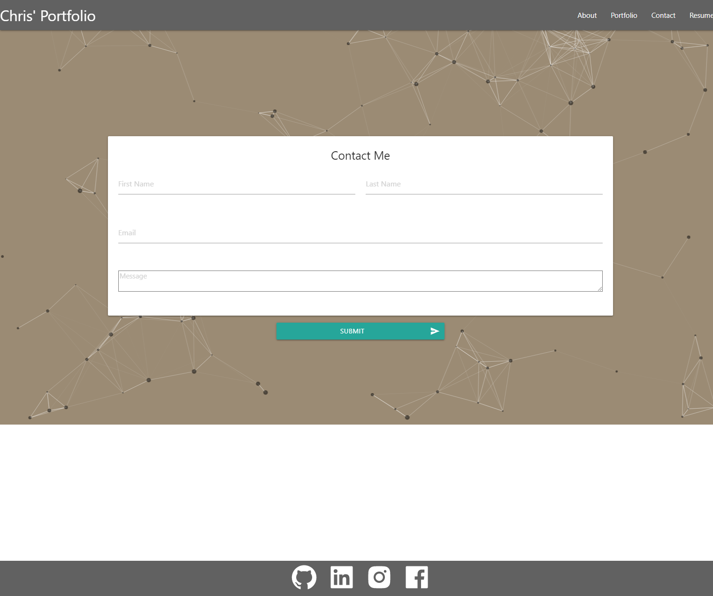

# React Portfolio

[Link to my profile](https://github.com/cujion)

[Link to deployed site](https://cujion.github.io/react-portfolio/)

## Table of Contents
- [Description](#description)
- [Visuals](#visuals)
- [Tests](#tests)
- [License](#license)

## Description
* This application is a single page React application. With this application you learn how to build a react front end app from scratch. You will leverage a ton of different concepts which include, how to render different html page layout files in order to be able change pages without reloading the entire page each time. another concept used is event handling, for example when viewing on smaller screen sizes the navbar tabs will turn into a hamburger icon which you can then click on to display a sidenav in order to be able to switch between each of the pages. This application is used to display and about me page which consists of an profile picture and a short description, a portfolio page which displays 6 different projects. We also have a contact me form submission and finally a resume page which has an icon at the bottom that can be clicked on to be directed to a google doc pdf file of my resume.

## Visuals

## License
* MIT License

* Copyright (c) [2022]] [Christopher Bonime]

* Permission is hereby granted, free of charge, to any person obtaining a copy
of this software and associated documentation files (the "Software"), to deal
in the Software without restriction, including without limitation the rights
to use, copy, modify, merge, publish, distribute, sublicense, and/or sell
copies of the Software, and to permit persons to whom the Software is
furnished to do so, subject to the following conditions:

* The above copyright notice and this permission notice shall be included in all
copies or substantial portions of the Software.

* THE SOFTWARE IS PROVIDED "AS IS", WITHOUT WARRANTY OF ANY KIND, EXPRESS OR
IMPLIED, INCLUDING BUT NOT LIMITED TO THE WARRANTIES OF MERCHANTABILITY,
FITNESS FOR A PARTICULAR PURPOSE AND NONINFRINGEMENT. IN NO EVENT SHALL THE
AUTHORS OR COPYRIGHT HOLDERS BE LIABLE FOR ANY CLAIM, DAMAGES OR OTHER
LIABILITY, WHETHER IN AN ACTION OF CONTRACT, TORT OR OTHERWISE, ARISING FROM,
OUT OF OR IN CONNECTION WITH THE SOFTWARE OR THE USE OR OTHER DEALINGS IN THE
SOFTWARE.